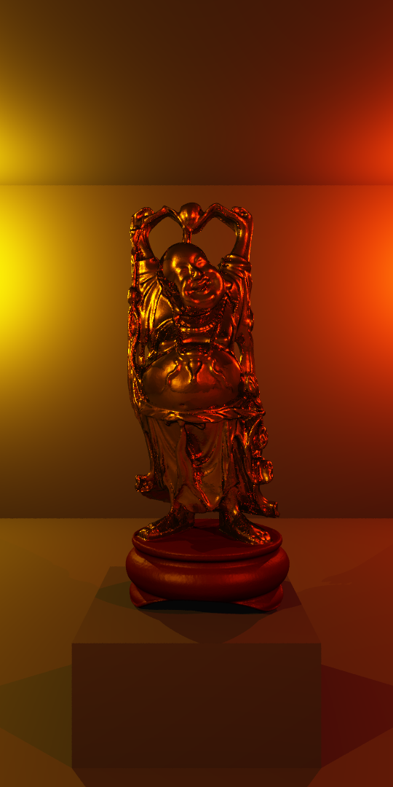

# Raytracing

This project is a software raytracer made for educational purposes. It uses the [tinyobjloader](https://github.com/tinyobjloader/tinyobjloader) for loading `.OBJ` files, but besides that, is completely made from scratch. Features include:
- Physically based lighting;
- HDR rendering and exposure-based tone mapping;  
- Rendering implicit spheres, as well as mesh-based models;
- Model and material loading from `.OBJ`/`.MTL` files;
- A SAH-based acceleration structure;
- Multi-threading;
- Output to `.BMP` files.

## Rendering
For each pixel on the screen, multiple rays are shot into the scene. When a ray intersects with an object, the color of that ray is determined by approximating the rendering equation at the point of intersection. Shadow-rays are shot to all lights in the scene, checking for occlusion. The cook-torrance BRDF is used to determine the influence of each light on the surface point.

If a material is smooth enough, it will also show a reflection. This is done by tracing an additional reflection ray. Reflection rays can create new reflection rays themselves, thus creating nested reflections.

The different samples taken for each pixel are averaged, creating an Anti Aliasing effect.

## Acceleration Structure
This raytracer can handle scenes with millions of triangles. Depending on the number of smooth surfaces, rendering often takes less than a minute! To achieve this, an acceleration structure is built that greatly speeds up ray-triangle intersection. More specifically, this project uses a Bounding Volume Hierarchy (BVH) constructed using the Surface Area Heuristic (SAH) technique proposed by [Ingo Wald](https://doi.org/10.1109/RT.2007.4342588).

## Model Loading
Models and materials can be loaded directly from `.OBJ` and `.MTL` files respectively. This way, scenes can be edited in third party software. For the examples in this project, I used [Blender](https://www.blender.org/). Objects can have multiple materials, and per-face material indexing is supported.

## Credits
- In the making of the various scenes displayed in this project, models were used from the [Stanford 3D Scanning Repository](http://graphics.stanford.edu/data/3Dscanrep/). Credits go to the Stanford Computer Graphics Laboratory.
- The acceleration structure used in this implementation is based on the 2007 [paper](https://doi.org/10.1109/RT.2007.4342588) by Ingo Wald.
- Physically Based Rendering was implemented based on the [LearnOpenGL](https://learnopengl.com/PBR/Theory) resource on PBR. 
